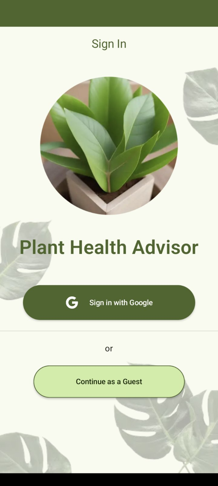
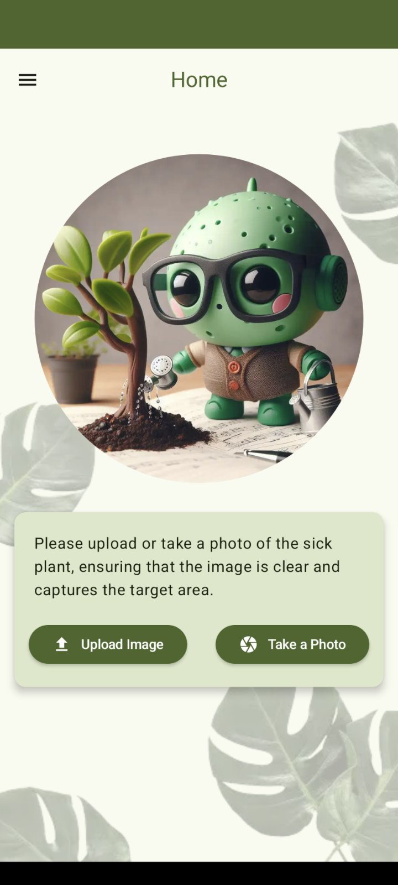
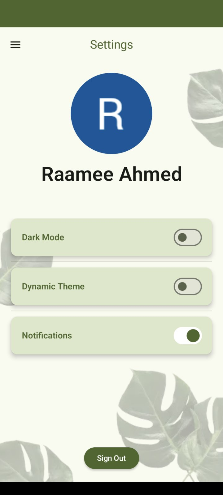

    

## Project Overview
- This is a plant disease detection app built using a custom classification machine learning model and Android Studio. Designed to help gardeners and plant hobbyists identify plant diseases in real-time, the app offers a modern and responsive user interface.
- This project was a group effort completed as part of our MSc in Computer Science program.

## Screenshots

  
  
  
  
  

## Technologies Used
- **Machine Learning**: Image classification model.
- **Firebase**: Realtime Database for data storage and Push Notifications for user alerts.
- **Network Calls**: Retrofit.
- **Programming Language**: Kotlin.
- **UI**: Jetpack Compose.
